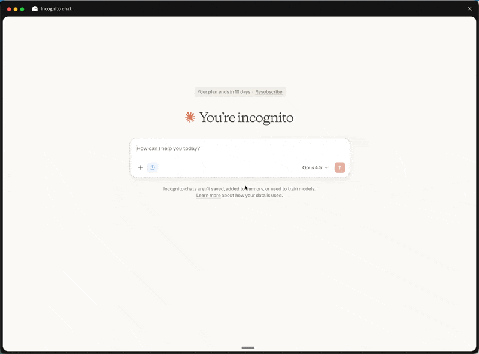

# limps

**L**ocal **I**ntelligent **M**CP **P**lanning **S**erver - AI agent plan management and coordination.

[](https://www.npmjs.com/package/@sudosandwich/limps)
[](https://opensource.org/licenses/MIT)




*Claude Desktop accessing the planning MCP, talking to Runi project docs*

## The Problem limps Solves

**Context drift between LLM providers** — Each AI assistant (Claude, ChatGPT, Cursor, GitHub Copilot, etc.) maintains its own separate context. Without a shared source of truth, planning documents, task status, and decisions get fragmented across different conversations and sessions.

limps solves this by providing a **standardized MCP interface** that any MCP-compatible tool can access. Your planning documents, tasks, and decisions live in one place, accessible to:

- **Claude Desktop** — Full access to search, read, update, create documents, claim tasks, and more
- **Cursor** — Integrated planning and task management via MCP tools
- **GitHub Copilot** — When MCP support is enabled
- **Any MCP-compatible tool** — Standard protocol means universal access

### Deployment Options

- **Local (Default)** — Run limps locally for secure, private access
- **Deployed** — You can deploy the MCP server for global access, but **research AUTH** to protect your endpoint and documents

## Used In Production

limps is actively used to build [runi](https://github.com/paulbreuler/runi) - managing planning documents, agent coordination, and task tracking across the development lifecycle.

### How runi Uses limps

The [runi](https://github.com/paulbreuler/runi) project uses a separate git repository ([runi-planning-docs](https://github.com/paulbreuler/runi-planning-docs)) for version-controlled planning documents. Custom Cursor commands in `.cursor/commands/` integrate with limps tools:


**Core Commands:**

| Command | Description | MCP Tools Used |
|---------|-------------|----------------|
| `/create-feature-plan` | Generate TDD plan with docs and agent files | `create_plan`, `create_doc`, `list_docs` |
| `/list-feature-plans` | List all plans with clickable file paths | `list_docs`, `read_doc` |
| `/run-agent` | Start work on next agent task | `read_doc`, `rlm_query`, `claim_task` |
| `/close-feature-agent` | Verify completion, sync status | `read_doc`, `update_doc`, `release_task` |
| `/update-feature-plan` | Regenerate agents from updated plan | `read_doc`, `create_doc`, `rlm_multi_query` |
| `/plan-list-agents` | Show all agents with status | `list_docs`, `rlm_multi_query` |

**Example: `/create-feature-plan` using MCP tools:**

```typescript
// 1. Find next plan number
const plans = await list_docs({ path: 'plans/', pattern: '*' });
const nextNum = Math.max(...plans.map(p => parseInt(p.name))) + 1;

// 2. Create plan structure
await create_plan({ name: `${nextNum}-my-feature`, description: '...' });

// 3. Create planning documents
await create_doc({ path: `plans/${nextNum}-my-feature/plan.md`, content: '...' });
await create_doc({ path: `plans/${nextNum}-my-feature/interfaces.md`, content: '...' });
```

**Example: `/run-agent` using RLM query:**

```typescript
// Extract next GAP feature from plan
const nextGap = await rlm_query({
  path: `plans/${planName}/plan.md`,
  code: `
    const features = extractFeatures(doc.content);
    const gaps = features.filter(f => f.status === 'GAP');
    return gaps.sort((a, b) => a.priority - b.priority)[0];
  `,
});
```

**Project Structure:**

```
runi/                          # Main codebase
├── .cursor/commands/          # Cursor slash commands
│   ├── create-feature-plan.md
│   ├── list-feature-plans.md
│   ├── run-agent.md
│   ├── close-feature-agent.md
│   └── update-feature-plan.md
└── .claude/commands/          # Claude Code commands
    └── pr.md

runi-planning-docs/            # Separate git repo for plans
├── plans/
│   ├── 0004-datagrid/        # Feature plan
│   │   ├── plan.md           # Full specifications
│   │   ├── interfaces.md     # Interface contracts
│   │   ├── README.md         # Status index
│   │   ├── gotchas.md        # Discovered issues
│   │   └── agents/           # Agent task files
│   └── ...
└── decisions/                 # Decision log
```

## Installation

### Global Install (Recommended)

```bash
npm install -g @sudosandwich/limps
```

### Quick Setup

```bash
limps init my-project --docs-path ~/Documents/my-project
```

This creates a config and outputs the Cursor/Claude Desktop configuration snippets with full paths.

## CLI Commands

limps provides a full CLI for managing projects and viewing plans without needing an MCP client.

```bash
limps --help              # Show all commands
limps <command> --help    # Show command help
```

### Project Management

| Command | Description |
|---------|-------------|
| `limps init <name>` | Initialize a new project |
| `limps serve` | Start the MCP server |

### Plan Commands

| Command | Description |
|---------|-------------|
| `limps list-plans` | List all plans with status |
| `limps list-agents <plan>` | List agents in a plan |
| `limps next-task <plan>` | Get the highest-priority available task |
| `limps status <plan>` | Show plan status summary |

### Configuration

| Command | Description |
|---------|-------------|
| `limps config list` | Show all registered projects |
| `limps config use <name>` | Switch to a different project |
| `limps config show` | Display resolved configuration |
| `limps config path` | Print the config file path |
| `limps config add <name> <path>` | Register an existing config |
| `limps config remove <name>` | Unregister a project |
| `limps config set <path>` | Set current from config path |
| `limps config discover` | Find configs in default locations |

### Multi-Project Workflow

```bash
# Register multiple projects
limps init project-a --docs-path ~/Documents/project-a
limps init project-b --docs-path ~/Documents/project-b

# Switch between projects
limps config use project-a
limps list-plans

limps config use project-b
limps list-plans

# Use environment variable
LIMPS_PROJECT=project-a limps list-plans
```

### Example: Git-based Document Versioning

Point limps at a git repository to version control your planning documents:

```bash
# Create a dedicated docs repo
mkdir ~/Documents/GitHub/my-planning-docs
cd ~/Documents/GitHub/my-planning-docs
git init

# Initialize limps with your docs repo
limps init my-project --docs-path ~/Documents/GitHub/my-planning-docs
```

This approach gives you:
- **Version history** for all plans and decisions
- **Branching** for experimental planning
- **Collaboration** via pull requests
- **Backup** through remote repositories

### Manual Configuration

The server automatically finds configuration at OS-specific locations:

| OS | Config Location |
|----|-----------------|
| macOS | `~/Library/Application Support/limps/config.json` |
| Linux | `~/.config/limps/config.json` |
| Windows | `%APPDATA%\limps\config.json` |

### From Source

```bash
git clone https://github.com/paulbreuler/limps.git
cd limps
npm install
npm run build
```

## Configuration

Create a `config.json` at the OS-specific location or specify a path:

```json
{
  "plansPath": "~/Documents/my-plans",
  "docsPaths": ["~/Documents/my-plans"],
  "fileExtensions": [".md"],
  "dataPath": "~/Library/Application Support/limps/data",
  "coordinationPath": "~/Library/Application Support/limps/coordination.json",
  "heartbeatTimeout": 300000,
  "debounceDelay": 200,
  "maxHandoffIterations": 3
}
```

**Config priority:**
1. CLI: `limps --config /path/to/config.json`
2. Environment: `MCP_PLANNING_CONFIG=/path/to/config.json`
3. OS-specific default location

**Path options:**
- Tilde expansion: `~/Documents/plans`
- Absolute: `/Users/john/Documents/plans`
- Relative (to config file): `./plans`

## Cursor Setup

Add to Cursor settings (`Cmd+Shift+P` → "Preferences: Open User Settings (JSON)"):

```json
{
  "mcp.servers": {
    "limps": {
      "command": "limps"
    }
  }
}
```

With explicit config:
```json
{
  "mcp.servers": {
    "limps": {
      "command": "limps",
      "args": ["--config", "/path/to/config.json"]
    }
  }
}
```

## Claude Desktop Setup

Claude Desktop runs in a macOS sandbox and cannot access global npm binaries. Use `npx` instead.

Add to `~/Library/Application Support/Claude/claude_desktop_config.json`:

```json
{
  "mcpServers": {
    "limps": {
      "command": "npx",
      "args": ["-y", "@sudosandwich/limps", "--config", "/path/to/config.json"]
    }
  }
}
```

> **Note:** Run `limps init my-project` first to generate the config, then copy the full path into the config above.

## Features

### Document Management (14 Tools)

| Tool | Description |
|------|-------------|
| `read_doc` | Read full document content |
| `create_doc` | Create new documents |
| `update_doc` | Update with optimistic concurrency |
| `delete_doc` | Delete documents |
| `list_docs` | List files and directories |
| `search_docs` | Full-text search (SQLite FTS5) |
| `rlm_query` | JavaScript filter/transform on documents |
| `rlm_multi_query` | Cross-document analysis with globs |
| `create_plan` | Create feature plans with structure |
| `update_task_status` | Update task status (GAP → WIP → PASS) |
| `claim_task` | Claim tasks with file locks |
| `release_task` | Release tasks and locks |
| `get_next_task` | Get highest-priority available task |
| `open_document_in_cursor` | Open files in Cursor editor |

### RLM (Recursive Language Model) Support

Implements the [RLM pattern from MIT CSAIL](https://arxiv.org/abs/2512.24601) for programmatic document examination and recursive processing:

- **Sandbox execution** - Secure JavaScript via QuickJS
- **Recursive sub-calls** - Depth-limited processing
- **Parallel execution** - Cross-document analysis
- **Document extractors** - Markdown, YAML, Gherkin parsing

### Resources (Progressive Disclosure)

- `plans://index` — List of all plans (minimal)
- `plans://summary` — Plan summaries (key info)
- `plans://full` — Full plan documents
- `decisions://log` — Decision log entries
- `agents://status` — Agent status and tasks

## Development

```bash
npm install       # Install dependencies
npm test          # Run tests
npm run build     # Build TypeScript
npm run dev       # Watch mode
npm run lint      # ESLint check
npm run format    # Prettier format
```

Pre-commit hooks run lint-staged, build, and tests automatically.

## Releasing

```bash
# Update version in package.json, then:
git tag v0.2.1
git push origin v0.2.1
```

GitHub Actions automatically builds, tests, and creates releases with changelogs.

## Architecture


- Full-text search with auto-indexing
- Real-time file watching (Chokidar)
- Multi-agent coordination with heartbeats
- RLM sandbox (QuickJS)

### Principles

1. Simplicity over complexity
2. Local-first, no external dependencies
3. Progressive disclosure (index → summary → full)
4. Optimistic concurrency
5. Scoring-based task selection

## Adapting for Other Uses

The server is designed for planning documents but the core is generic:

**Configuration-only:**

```json
{
  "plansPath": "./your-docs",
  "docsPaths": ["./content", "./docs"],
  "fileExtensions": [".md", ".txt", ".rst"]
}
```

**For different domains** (wikis, knowledge bases):

- Replace/remove planning-specific tools
- Customize document extractors in `src/rlm/extractors.ts`
- Modify coordination patterns or remove if single-agent

## What is MCP?

**MCP (Model Context Protocol)** is a standardized protocol for AI applications to connect to external systems. Launched by Anthropic (Nov 2024), now part of the Linux Foundation's Agentic AI Foundation.

- [MCP Specification](https://modelcontextprotocol.io/)
- [MCP Documentation](https://modelcontextprotocol.io/docs)

## License

MIT
