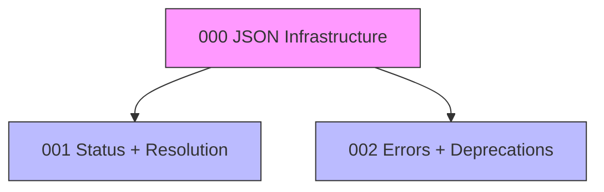

# Plan 0001: Limps v2.0 P0 Overhaul

**Status:** In Progress
**Work Type:** Overhaul
**Target:** v1.2.0 (non-breaking) → v2.0.0 (breaking)

---

## Overview

Implements P0 (highest priority) features from the limps v2.0 specification:

- JSON output for CI/CD and scripting
- Per-agent status visibility
- Shorthand task ID resolution
- Improved error messages with suggestions
- Deprecation warnings for config options

---

## Dependency Graph



---

## Status Matrix

| Agent | Title | Status | Features | Dependencies |
|-------|-------|--------|----------|--------------|
| 000 | JSON Output Infrastructure | `PASS` | #1 | None |
| 001 | Per-Agent Status + Resolution | `PASS` | #2, #3 | Agent 000 |
| 002 | Error Messages + Deprecations | `PASS` | #4, #5 | Agent 000 |

---

## Feature Status

| ID | Feature | Agent | Status |
|----|---------|-------|--------|
| #1 | JSON Output Infrastructure | 000 | `PASS` |
| #2 | Per-Agent Status | 001 | `PASS` |
| #3 | Shorthand Task ID Resolution | 001 | `PASS` |
| #4 | Improved Error Messages | 002 | `PASS` |
| #5 | Config Deprecation Warnings | 002 | `PASS` |

---

## Files

| File | Purpose |
|------|---------|
| [plan.md](./plan.md) | Full specifications |
| [interfaces.md](./interfaces.md) | TypeScript contracts |
| [gotchas.md](./gotchas.md) | Discovered issues |
| [agents/](./agents/) | Agent task files |

---

## Quick Commands

```bash
# Check plan status
limps status 0001

# Get next available task
limps next-task --plan 0001

# List all agents
limps list-agents 0001
```

---

## Release Plan

1. **v1.2.0-alpha**: Agent 000 complete (JSON infrastructure)
2. **v1.2.0-beta**: Agent 001 complete (status + resolution)
3. **v1.2.0**: All agents complete, full P0 implementation
4. **v2.0.0**: Apply breaking changes (remove deprecated options)
