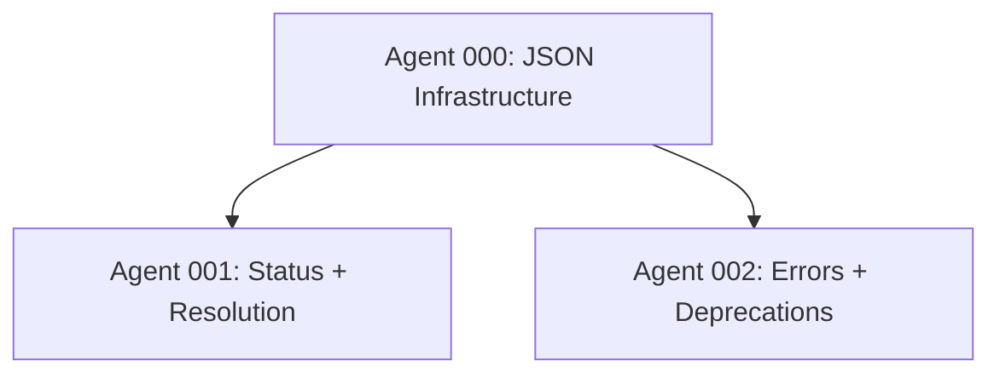

# Limps v2.0 P0 Overhaul

**Status:** Draft
**Work Type:** Overhaul
**Created:** 2026-01-25
**Target Release:** v1.2.0 (foundation), v2.0.0 (breaking changes)

---

## Executive Summary

This plan implements the P0 (highest priority) features from the limps v2.0 specification, focusing on:

1. **JSON output** for all CLI commands (CI/CD, scripting)
2. **Per-agent status** via `--agent` flag (granular visibility)
3. **Shorthand task ID resolution** (developer ergonomics)
4. **Improved error messages** with contextual suggestions
5. **Config deprecation warnings** for `maxHandoffIterations` and `debounceDelay`

**Core philosophy:** Lightweight coordination, not orchestration. Build visibility tools, not automation.

---

## Features

### #1: JSON Output Infrastructure

**TL;DR:** Add `--json` flag to all CLI commands for machine-readable output.

**Status:** `GAP`

**Why:** CI/CD pipelines and scripts need structured output. Human-readable output is nice but not scriptable.

#### Gherkin Scenarios

```gherkin
Feature: JSON output for CLI commands

  Scenario: List plans with JSON output
    Given the user runs `limps list-plans --json`
    When the command executes
    Then stdout contains valid JSON
    And the JSON has structure: { "success": true, "data": [...] }
    And stderr is empty (no spinner/UI noise)

  Scenario: Status with JSON output
    Given a plan exists with ID "0001"
    When the user runs `limps status 0001 --json`
    Then stdout contains valid JSON
    And the JSON has structure: { "success": true, "data": { "planName": "...", ... } }

  Scenario: Error with JSON output
    Given no plan exists with ID "9999"
    When the user runs `limps status 9999 --json`
    Then stdout contains valid JSON
    And the JSON has structure: { "success": false, "error": "...", "suggestions": [...] }
    And exit code is non-zero

  Scenario: Next-task with JSON output
    Given a plan with available tasks
    When the user runs `limps next-task --plan 0001 --json`
    Then stdout contains JSON with score breakdown
    And the JSON includes: taskId, totalScore, dependencyScore, priorityScore, workloadScore
```

#### TDD Cycles

1. `test: json-output-flag-parsing` → Add `--json` to Pastel CLI options → Extract to shared type
2. `test: json-envelope-success` → Create `wrapSuccess(data)` helper → Returns `{ success: true, data }`
3. `test: json-envelope-error` → Create `wrapError(msg, suggestions?)` helper → Returns `{ success: false, error, suggestions }`
4. `test: list-plans-json` → Modify `list-plans` command to use envelope → Conditionally render JSON vs Ink
5. `test: list-agents-json` → Modify `list-agents` command → Same pattern
6. `test: status-json` → Modify `status` command → Export `PlanStatusSummary` as JSON
7. `test: next-task-json` → Modify `next-task` command → Export `TaskScoreBreakdown` as JSON
8. `test: config-show-json` → Modify `config show` command → Export config object
9. `test: config-list-json` → Modify `config list` command → Export project list

#### Files

- `src/cli/json-output.ts` (create) - JSON envelope helpers
- `src/cli/list-plans.tsx` (modify) - Add --json flag
- `src/cli/list-agents.tsx` (modify) - Add --json flag
- `src/cli/status.tsx` (modify) - Add --json flag, refactor to use envelope
- `src/cli/next-task.tsx` (modify) - Add --json flag
- `src/cli/config-cmd.tsx` (modify) - Add --json to show/list

#### Gotchas

- **Ink/React rendering**: When `--json` is set, bypass Ink entirely. Use `console.log(JSON.stringify(...))` and exit.
- **Exit codes**: Error states must set `process.exitCode = 1` before returning.
- **Stderr vs stdout**: Progress indicators (spinners) go to stderr; only final JSON to stdout.

---

### #2: Per-Agent Status

**TL;DR:** Add `limps status --agent <id>` for granular agent visibility.

**Status:** `GAP`

**Why:** Current `limps status` only shows plan-level summary. Users need to see individual agent state, claim status, heartbeat age, and feature progress.

#### Gherkin Scenarios

```gherkin
Feature: Per-agent status

  Scenario: View agent status by shorthand ID
    Given plan "0001-network-panel" exists with agent "002"
    And agent "002" is claimed with status WIP
    When the user runs `limps status --agent 0001#002`
    Then output shows agent title, status, claimed time
    And output shows feature breakdown (PASS/WIP/GAP/BLOCKED counts)
    And output shows files claimed
    And output shows dependency status

  Scenario: View agent status with full path
    Given plan "0001-network-panel" exists with agent "002"
    When the user runs `limps status --agent plans/0001-network-panel/agents/002-api.agent.md`
    Then output shows the same as shorthand

  Scenario: View agent status with agent number only (context required)
    Given plan "0001-network-panel" is detected from git context
    When the user runs `limps status --agent 002`
    Then output shows agent 002 from the detected plan

  Scenario: JSON output for agent status
    Given plan "0001" exists with agent "002"
    When the user runs `limps status --agent 0001#002 --json`
    Then stdout contains JSON with agent details
    And JSON includes: taskId, title, status, claimed, heartbeat, features, files, dependencies
```

#### TDD Cycles

1. `test: resolve-agent-from-shorthand` → Create `resolveAgentId()` utility → Parse `0001#002` format
2. `test: resolve-agent-from-path` → Extend resolver for full path input → Extract plan/agent from path
3. `test: get-agent-status-summary` → Create `getAgentStatusSummary()` → Read agent file + coordination
4. `test: agent-status-includes-heartbeat` → Query coordination.json for heartbeat → Calculate elapsed time
5. `test: agent-status-includes-features` → Parse agent file for feature sections → Count by status
6. `test: agent-status-includes-dependencies` → Parse frontmatter dependencies → Check satisfaction
7. `test: status-command-accepts-agent-flag` → Add `--agent` option to status command → Route to agent handler
8. `test: agent-status-human-output` → Format agent status as box UI → Use Ink Box component
9. `test: agent-status-json-output` → Return JSON envelope when `--json` → Reuse from #1

#### Files

- `src/cli/agent-resolver.ts` (create) - Resolve agent IDs from various formats
- `src/cli/status.ts` (modify) - Add `--agent` flag and `getAgentStatusSummary()`
- `src/cli/status.tsx` (modify) - Add agent status UI component

#### Gotchas

- **Heartbeat staleness**: Need to read coordination.json, not just agent file mtime.
- **Feature extraction**: Agent files don't have frontmatter for features. Need to parse markdown sections.
- **Dependency resolution**: Dependencies in frontmatter are agent numbers, need to resolve to full task IDs.

---

### #3: Shorthand Task ID Resolution

**TL;DR:** Support `0001#002`, `002`, and full paths interchangeably.

**Status:** `GAP`

**Why:** Typing `plans/0001-network-panel/agents/002-api.agent.md` is tedious. Support shorthands everywhere.

#### Gherkin Scenarios

```gherkin
Feature: Shorthand task ID resolution

  Scenario: Resolve full task ID
    Given plan "0001-network-panel" exists
    When resolving "0001-network-panel#002"
    Then result is { planFolder: "0001-network-panel", agentNumber: "002" }

  Scenario: Resolve plan#agent shorthand
    Given plan "0001-network-panel" exists
    When resolving "0001#002"
    Then result finds plan starting with "0001"
    And result is { planFolder: "0001-network-panel", agentNumber: "002" }

  Scenario: Resolve agent-only shorthand with context
    Given current plan context is "0001-network-panel"
    When resolving "002"
    Then result uses context plan
    And result is { planFolder: "0001-network-panel", agentNumber: "002" }

  Scenario: Ambiguous shorthand
    Given plans "0001-feature-a" and "0001-feature-b" exist
    When resolving "0001#002"
    Then error is thrown with message listing both options

  Scenario: Resolve file path
    Given file "plans/0001-network-panel/agents/002-api.agent.md" exists
    When resolving "plans/0001-network-panel/agents/002-api.agent.md"
    Then result extracts plan and agent from path
```

#### TDD Cycles

1. `test: parse-full-task-id` → Use existing `parseTaskId()` → Already handles `planFolder#agentNumber`
2. `test: resolve-plan-prefix` → Create `findPlanByPrefix()` → Glob plans starting with prefix
3. `test: resolve-shorthand-plan-agent` → Parse `0001#002` → Find plan, build full ID
4. `test: resolve-agent-only-with-context` → Accept optional `planContext` → Use when agent number only
5. `test: resolve-from-path` → Parse path format → Extract via regex
6. `test: ambiguous-shorthand-error` → Multiple matches → Throw with suggestions
7. `test: integrate-shorthand-in-claim-task` → Use resolver in claim-task CLI → Replace direct ID usage
8. `test: integrate-shorthand-in-release-task` → Use resolver in release-task CLI → Same pattern
9. `test: integrate-shorthand-in-next-task` → Use resolver for --plan flag → Support prefix

#### Files

- `src/cli/task-resolver.ts` (create) - Unified task ID resolution
- `src/cli/claim-task.tsx` (modify) - Use resolver
- `src/cli/release-task.tsx` (modify) - Use resolver
- `src/cli/next-task.tsx` (modify) - Use resolver for --plan

#### Gotchas

- **Case sensitivity**: Plan folder names are case-sensitive on Linux, insensitive on macOS.
- **Performance**: Glob operations should be cached for repeated calls.
- **Context detection**: Agent-only resolution needs git context detection (P1 feature) or explicit context.

---

### #4: Improved Error Messages

**TL;DR:** Add contextual suggestions and "did you mean?" to all errors.

**Status:** `GAP`

**Why:** Generic errors like "Task not found: 0001#999" are unhelpful. Show what exists and suggest alternatives.

#### Gherkin Scenarios

```gherkin
Feature: Improved error messages

  Scenario: Task not found with suggestions
    Given plan "0001" exists with agents 000, 001, 002
    When user runs `limps status --agent 0001#999`
    Then error message shows "Task not found: 0001#999"
    And error shows available agents: 000, 001, 002
    And error suggests closest match if any

  Scenario: Plan not found with suggestions
    Given plans "0001-auth", "0002-api" exist
    When user runs `limps status 0003`
    Then error message shows "Plan not found: 0003"
    And error shows available plans
    And error suggests "Did you mean 0001 or 0002?"

  Scenario: Invalid task ID format
    Given user runs `limps status --agent invalid-format`
    Then error shows expected formats
    And error provides examples: "0001#002", "002", "plans/.../agents/..."
```

#### TDD Cycles

1. `test: error-with-suggestions` → Create `LimpsError` class → Includes `suggestions` array
2. `test: find-similar-plans` → Create `findSimilarPlans()` → Levenshtein or prefix match
3. `test: find-similar-agents` → Create `findSimilarAgents()` → Same pattern
4. `test: error-format-human` → Format error with box UI → Show error + suggestions
5. `test: error-format-json` → Format error as JSON envelope → Include suggestions array
6. `test: integrate-error-in-status` → Update status command → Catch errors, enhance, re-throw
7. `test: integrate-error-in-next-task` → Update next-task command → Same pattern
8. `test: format-examples-in-error` → Include usage examples in format errors → Help text

#### Files

- `src/utils/errors.ts` (modify) - Add `LimpsError` class with suggestions
- `src/utils/suggestions.ts` (create) - Similarity matching utilities
- `src/cli/error-handler.tsx` (create) - Error formatting for CLI

#### Gotchas

- **Performance**: Levenshtein distance is O(n*m). For large plan counts, consider simpler prefix matching.
- **JSON mode**: Error suggestions must work in both human and JSON output modes.
- **Exit codes**: Enhanced errors still need proper exit codes.

---

### #5: Config Deprecation Warnings

**TL;DR:** Warn users about deprecated config options before v2.0 removal.

**Status:** `GAP`

**Why:** `maxHandoffIterations` and `debounceDelay` are being removed in v2.0. Give users advance notice.

#### Gherkin Scenarios

```gherkin
Feature: Config deprecation warnings

  Scenario: Deprecated option in config
    Given config.json contains "maxHandoffIterations": 3
    When limps starts
    Then stderr shows deprecation warning
    And warning mentions removal in v2.0
    And warning suggests migration path

  Scenario: Multiple deprecated options
    Given config.json contains both deprecated options
    When limps starts
    Then warnings show for each deprecated option

  Scenario: No warning for clean config
    Given config.json has no deprecated options
    When limps starts
    Then no deprecation warnings appear

  Scenario: JSON output suppresses warnings
    Given config.json contains deprecated options
    When user runs `limps list-plans --json`
    Then deprecation warnings go to stderr only
    And stdout contains clean JSON
```

#### TDD Cycles

1. `test: detect-deprecated-config` → Create `checkDeprecations()` → Returns list of deprecated keys
2. `test: format-deprecation-warning` → Create warning message format → Include key, reason, migration
3. `test: emit-warnings-to-stderr` → Write warnings to stderr → Not stdout
4. `test: integrate-in-config-load` → Call check in `loadConfig()` → Emit warnings
5. `test: json-mode-stderr-only` → Verify stdout clean → Stderr has warnings
6. `test: no-warnings-for-clean-config` → Clean config → No output to stderr

#### Files

- `src/config.ts` (modify) - Add `checkDeprecations()`, call on load
- `src/utils/deprecations.ts` (create) - Deprecation warning utilities

#### Gotchas

- **Startup performance**: Don't slow down startup with excessive checks.
- **MCP server mode**: Warnings should appear in server logs, not corrupt MCP protocol.
- **One-time warning**: Consider caching that warning was shown to avoid spam.

---

## Agent Assignment

### Agent 000: JSON Output Infrastructure

**Scope:** Feature #1
**Files:** `src/cli/json-output.ts`, modifications to all CLI commands
**Dependencies:** None
**Blocks:** Agent 001, 002 (need JSON support)

### Agent 001: Per-Agent Status + Shorthand Resolution

**Scope:** Features #2, #3
**Files:** `src/cli/agent-resolver.ts`, `src/cli/task-resolver.ts`, `src/cli/status.ts`
**Dependencies:** Agent 000 (JSON envelope helpers)
**Blocks:** None

### Agent 002: Error Messages + Deprecations

**Scope:** Features #4, #5
**Files:** `src/utils/errors.ts`, `src/utils/suggestions.ts`, `src/config.ts`
**Dependencies:** Agent 000 (JSON error format)
**Blocks:** None

---

## Dependency Graph



---

## Rollback Checkpoints

Since this is an overhaul:

1. **After Agent 000**: JSON output works. Can release as v1.2.0-alpha.
2. **After Agent 001**: Per-agent status works. Can release as v1.2.0-beta.
3. **After Agent 002**: Full P0 complete. Release as v1.2.0.

---

## Breaking Changes (for v2.0.0)

These are **not** implemented in this plan, but deprecation warnings prepare users:

1. `debounceDelay` config option → hardcode 200ms
2. `maxHandoffIterations` config option → remove handoff system
3. `limps next-task` without `--plan` → require explicit plan

---

## Test Strategy

- **Unit tests**: Each TDD cycle produces a test
- **Integration tests**: CLI command tests with temp directories
- **E2E tests**: Full workflow: create plan → claim task → check status → release

---

## Acceptance Criteria

- [ ] All CLI commands support `--json` flag
- [ ] `limps status --agent <id>` works with all ID formats
- [ ] Shorthand IDs work in claim-task, release-task, next-task
- [ ] Error messages include suggestions and "did you mean?"
- [ ] Deprecated config options show warnings
- [ ] Test coverage remains >70%
- [ ] All existing tests pass
