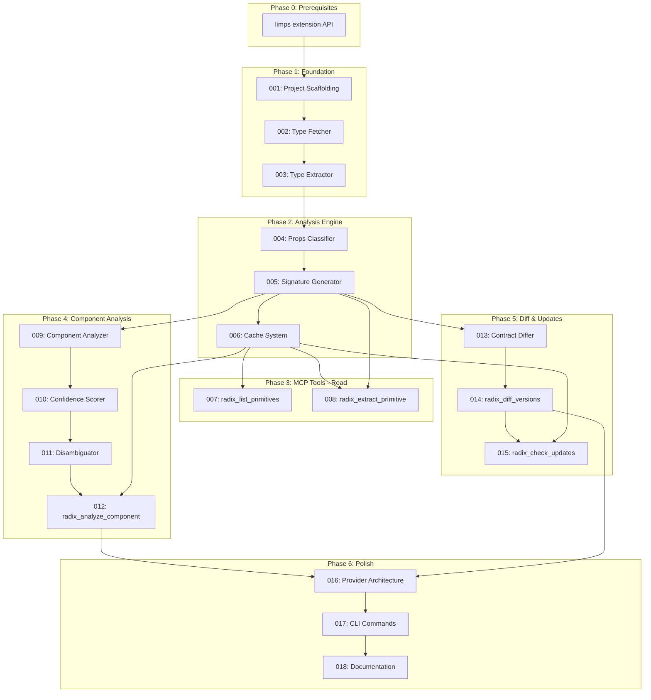

# 0025-limps-radix-extension

## Overview

`@sudosandwich/limps-radix` - Radix UI contract extraction, semantic analysis, and drift detection as a limps extension.

**Vision:** Apply runi's "collapse uncertainty into truth" pattern to UI component contracts. Detect when components drift from Radix patterns, verify AI-generated components follow best practices, track breaking changes across Radix releases.

## Dependency Graph

## Status Matrix

| # | Feature | Agent | Status | Blocks |
|---|---------|-------|--------|--------|
| 0 | limps extension API | 000 | GAP | All |
| 1 | Project Scaffolding | 000 | GAP | 2-18 |
| 2 | Type Fetcher | 001 | GAP | 3 |
| 3 | Type Extractor | 001 | GAP | 4 |
| 4 | Props Classifier | 001 | GAP | 5 |
| 5 | Signature Generator | 002 | GAP | 6-9, 13 |
| 6 | Cache System | 002 | GAP | 7-8, 12, 15 |
| 7 | radix_list_primitives | 003 | GAP | - |
| 8 | radix_extract_primitive | 003 | GAP | - |
| 9 | Component Analyzer | 004 | GAP | 10 |
| 10 | Confidence Scorer | 004 | GAP | 11 |
| 11 | Disambiguator | 004 | GAP | 12 |
| 12 | radix_analyze_component | 004 | GAP | - |
| 13 | Contract Differ | 005 | GAP | 14 |
| 14 | radix_diff_versions | 005 | GAP | 15 |
| 15 | radix_check_updates | 005 | GAP | - |
| 16 | Provider Architecture | 006 | GAP | 17 |
| 17 | CLI Commands | 006 | GAP | 18 |
| 18 | Documentation | 006 | GAP | - |

## Agent Assignments

| Agent | Features | Owns |
|-------|----------|------|
| 000 | #0, #1 | limps extension API, package setup |
| 001 | #2, #3, #4 | `src/fetcher/`, `src/extractor/` |
| 002 | #5, #6 | `src/signatures/`, `src/cache/` |
| 003 | #7, #8 | `src/tools/list.ts`, `src/tools/extract.ts` |
| 004 | #9, #10, #11, #12 | `src/analyzer/`, `src/tools/analyze.ts` |
| 005 | #13, #14, #15 | `src/differ/`, `src/tools/diff.ts`, `src/tools/updates.ts` |
| 006 | #16, #17, #18 | `src/providers/`, `src/cli/`, `docs/` |

## File Links

- [plan.md](./plan.md) - Full specifications
- [interfaces.md](./interfaces.md) - TypeScript contracts
- [gotchas.md](./gotchas.md) - Discovered issues

## Agents

| # | Agent | Features | Status | Files |
|---|-------|----------|--------|-------|
| 000 | [extension-api](./agents/000_agent_extension-api.agent.md) | limps extension API, package scaffolding | GAP | 8 |
| 001 | [extraction](./agents/001_agent_extraction.agent.md) | Type Fetcher, Extractor, Classifier | GAP | 9 |
| 002 | [signatures](./agents/002_agent_signatures.agent.md) | Signature Generator, Cache | GAP | 8 |
| 003 | [read-tools](./agents/003_agent_read-tools.agent.md) | radix_list_primitives, radix_extract_primitive | GAP | 3 |
| 004 | [analyzer](./agents/004_agent_analyzer.agent.md) | Component Analyzer, Scorer, Disambiguator | GAP | 12 |
| 005 | [differ](./agents/005_agent_differ.agent.md) | Contract Differ, radix_diff_versions | GAP | 7 |
| 006 | [polish](./agents/006_agent_polish.agent.md) | Provider arch, CLI, Documentation | GAP | 14 |
