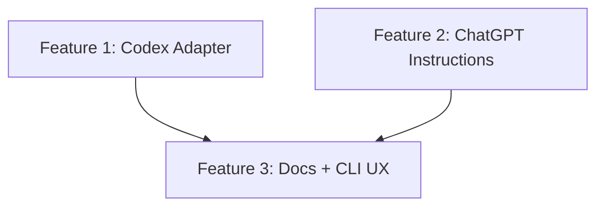

# Plan 0037: Codex + ChatGPT MCP Setup

## Status Matrix

| Feature | Status |
| --- | --- |
| #1 Codex MCP Client Adapter | GAP |
| #2 ChatGPT MCP Setup Guidance | GAP |
| #3 Docs + CLI UX Updates | GAP |

## Dependency Graph

## Agents

- Agent 000: Codex adapter + tests
- Agent 001: ChatGPT instructions + CLI/README updates
