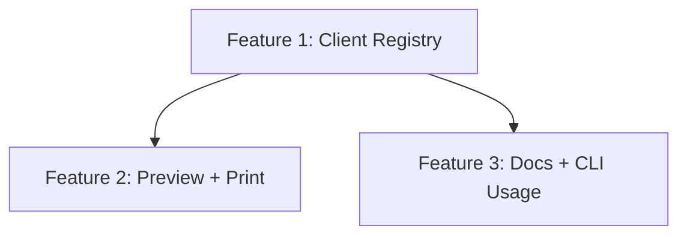

# Plan 0038: Composable MCP Client Sync

## Status Matrix

| Feature | Status |
| --- | --- |
| #1 Client Registry + Hook Interface | GAP |
| #2 Registry-Driven Preview + Print | GAP |
| #3 Docs + CLI Usage Updates | GAP |

## Dependency Graph

## Agents

- Agent 000: Registry + sync-mcp refactor
- Agent 001: Preview/print + tests
- Agent 002: Docs + CLI polish
