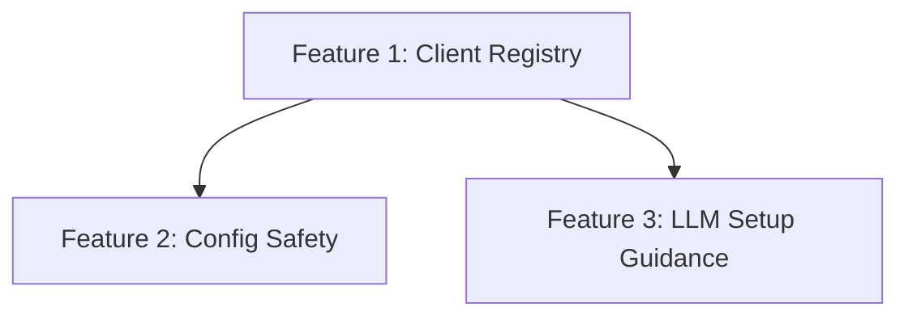

# Plan 0039: LLM Usage Improvements

## Status Matrix

| Feature | Status |
| --- | --- |
| #1 Composable Client Registry | PASS |
| #2 Safer Config Writes | PASS |
| #3 LLM Setup Guidance | PASS |
| #4 Agent Close Workflow Alignment | PASS |

## Dependency Graph

## Agents

- Agent 000: Registry refactor
- Agent 001: Config safety + error surfacing
- Agent 002: Docs + CLI guidance
