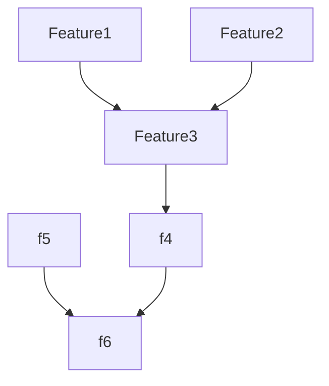

# 0041 limps improvements

## Status Matrix

| Feature | Status | Agent |
|---|---|---|
| #1 Semantic config + storage | GAP | Agent 0 |
| #2 Embedding pipeline + chunker | GAP | Agent 0 |
| #3 Semantic search tools | GAP | Agent 1 |
| #4 Query improvements + query_docs | GAP | Agent 2 |
| #5 AI requirements generation | GAP | Agent 3 |
| #6 Docs updates | GAP | Agent 4 |

## Dependency Graph

## Agent Assignments

- Agent 0: Features #1–#2
- Agent 1: Feature #3 (depends on Agent 0)
- Agent 2: Feature #4 (depends on Agent 1 for semantic integration)
- Agent 3: Feature #5
- Agent 4: Feature #6 (depends on Agents 0–3)

## Files

- `0041-limps-improvements-plan.md`
- `interfaces.md`
- `gotchas.md`
- `agents/`
