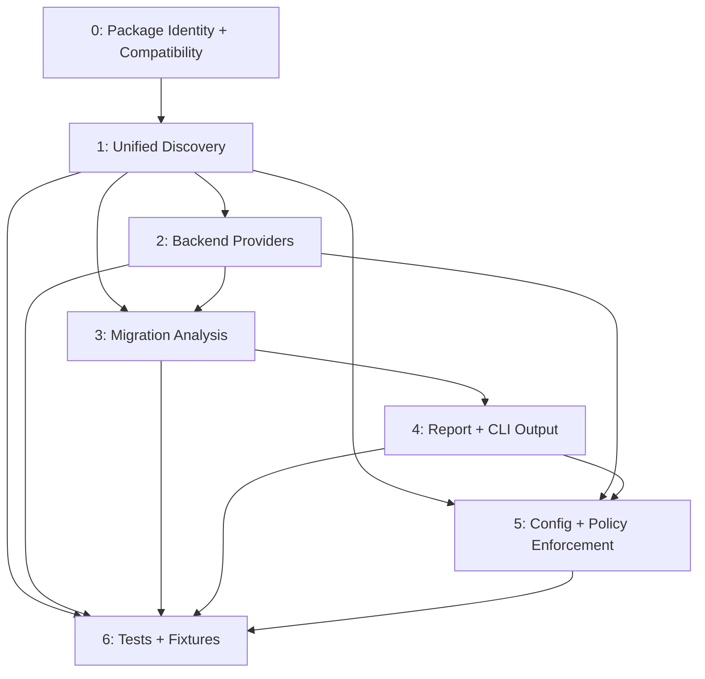

# 0042-limps-headless-pivot

## Overview

`@sudosandwich/limps-headless` replaces `limps-radix` with a backend-agnostic auditor supporting Radix (legacy) and Base UI (default). The plan focuses on detection, migration analysis, report updates, and policy enforcement.

## Dependency Graph

## Status Matrix

| # | Feature | Agent | Status | Blocks |
|---|---------|-------|--------|--------|
| 0 | Package Identity + Compatibility | 000 | GAP | 1, 5 |
| 1 | Unified Component Discovery | 001 | GAP | 2, 3, 5, 6 |
| 2 | Backend Providers | 001 | GAP | 3, 5, 6 |
| 3 | Migration Analysis | 002 | GAP | 4, 6 |
| 4 | Report + CLI Output | 002 | GAP | 5, 6 |
| 5 | Config + Policy Enforcement | 000 | GAP | 6 |
| 6 | Tests + Fixtures | 003 | GAP | - |

## Agent Assignments

| Agent | Features | Owns |
|-------|----------|------|
| 000 | 0, 5 | `packages/limps-headless/package.json`, `src/cli/*`, `src/config.ts` |
| 001 | 1, 2 | `src/audit/discover-components.ts`, `src/providers/*` |
| 002 | 3, 4 | `src/audit/analyses/migration.ts`, `src/audit/generate-report.ts` |
| 003 | 6 | `tests/*`, `tests/fixtures/*` |
