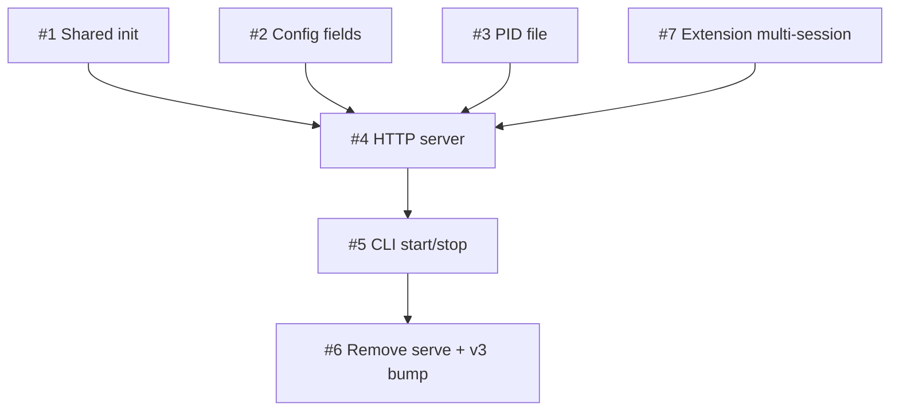

# 0049 Persistent HTTP Server

## Status Matrix

| Feature | Status | Agent |
|---|---|---|
| #1 Extract shared initialization | GAP | Agent 0 |
| #2 Server config fields | GAP | Agent 0 |
| #3 PID file management | GAP | Agent 0 |
| #7 Extension loading for multi-session | GAP | Agent 0 |
| #4 HTTP server with StreamableHTTPServerTransport | GAP | Agent 1 |
| #5 `limps start` and `limps stop` CLI | GAP | Agent 1 |
| #6 Remove `limps serve` and update CLI | GAP | Agent 2 |

## Dependency Graph

## Agent Assignments

- **Agent 0**: Features #1, #2, #3, #7 — Foundation (shared init, config, PID file, extensions)
- **Agent 1**: Features #4, #5 — HTTP server + CLI commands (depends on Agent 0)
- **Agent 2**: Feature #6 — Cleanup: remove serve, bump v3 (depends on Agent 1)

## Files

- `0049-persistent-http-server-plan.md` — Full specs
- `interfaces.md` — Contract definitions
- `gotchas.md` — Discoveries during implementation
- `agents/` — Agent execution files
