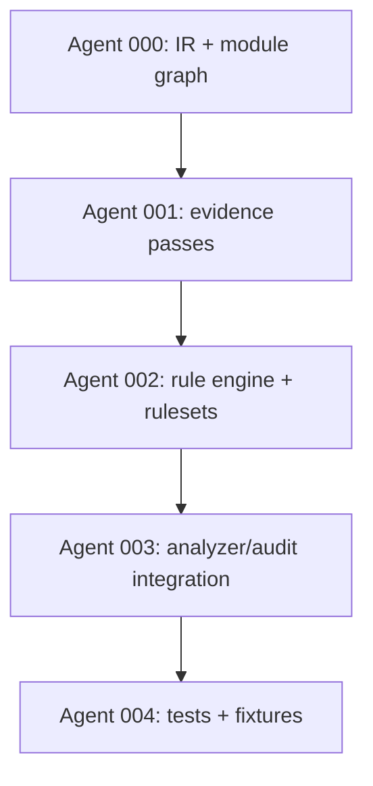

# limps Analysis IR Overhaul

Plan: `plans/0043-limps-analysis-ir-overhaul/0043-limps-analysis-ir-overhaul-plan.md`

## Summary

Overhaul limps-headless analysis using Component IR + rulesets to make Base UI detection precise and extensible while keeping outputs compatible.

## Dependency Graph

## Status Matrix

| Feature | Description | Status | Agent |
|---------|-------------|--------|-------|
| #0 | Component IR + module graph | PASS | Agent 000 |
| #1 | Evidence extraction passes | PASS | Agent 001 |
| #2 | Rule engine + ruleset DSL | PASS | Agent 002 |
| #3 | Analyzer + audit integration | PASS | Agent 003 |
| #4 | UX + policy surface | PASS | Agent 003 |
| #5 | Tests + fixtures | PASS | Agent 004 |

## Agents

- **Agent 000**: IR + module graph foundations
- **Agent 001**: Evidence extraction passes
- **Agent 002**: Rule engine + rulesets
- **Agent 003**: Integration + UX/policy output
- **Agent 004**: Tests + fixtures + docs validation

## Files

- Plan: `plans/0043-limps-analysis-ir-overhaul/0043-limps-analysis-ir-overhaul-plan.md`
- Interfaces: `plans/0043-limps-analysis-ir-overhaul/interfaces.md`
- Gotchas: `plans/0043-limps-analysis-ir-overhaul/gotchas.md`

## Notes

- Downstream app code (e.g., runi) is out of scope; this plan only touches limps-headless.
- Outputs must remain backward compatible; new fields are additive.
