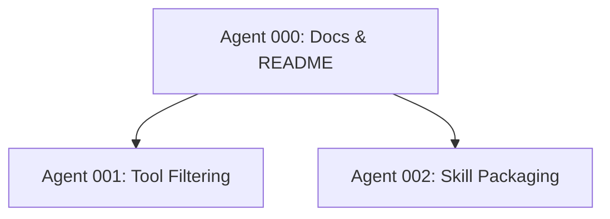

# Plan 0044: MCP Server Chart Learnings

## Overview

Improve limps docs and UX inspired by mcp-server-chart, add optional tool filtering, and publish a limps planning skill package.

## Dependency Graph

## Status Matrix

| Feature | Description | Status | Agent |
| --- | --- | --- | --- |
| #1 | README & docs parity | PASS | 000 |
| #2 | Tool filtering (allow/deny) | PASS | 001 |
| #3 | Publish limps planning skill | PASS | 002 |
| #4 | Transport roadmap docs | PASS | 000 |

## Agent Assignments

- **Agent 000: Docs & README**
  - Owns: #1, #4
  - Files: `README.md`, `packages/limps-headless/README.md`

- **Agent 001: Tool Filtering**
  - Owns: #2
  - Files: `packages/limps/src/tools/index.ts`, `packages/limps/src/config.ts`, `packages/limps/src/types.ts`, tests

- **Agent 002: Skill Packaging**
  - Owns: #3
  - Files: `skills/limps-planning/*`, README updates

## Notes

- Keep tool names aligned with actual tool IDs in `packages/limps/src/tools/index.ts`.
- Ensure docs changes are consistent across limps and limps-headless if applicable.
